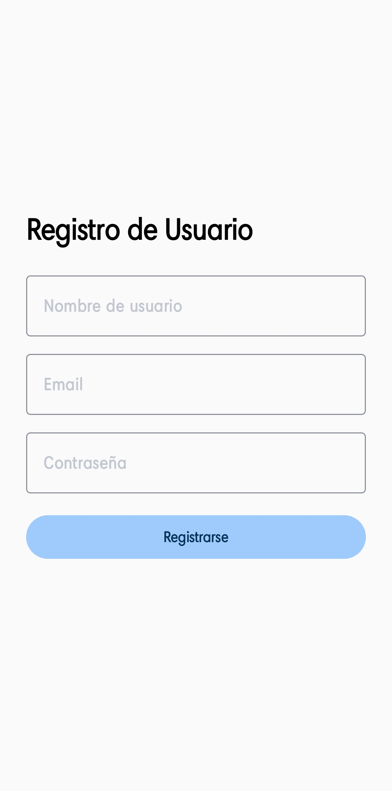
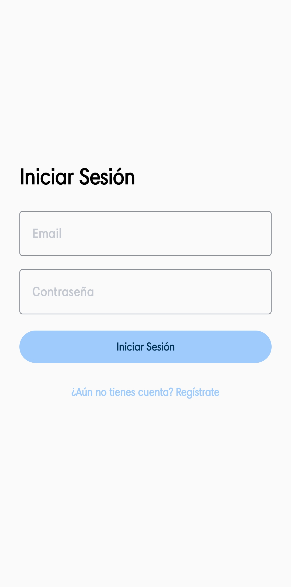
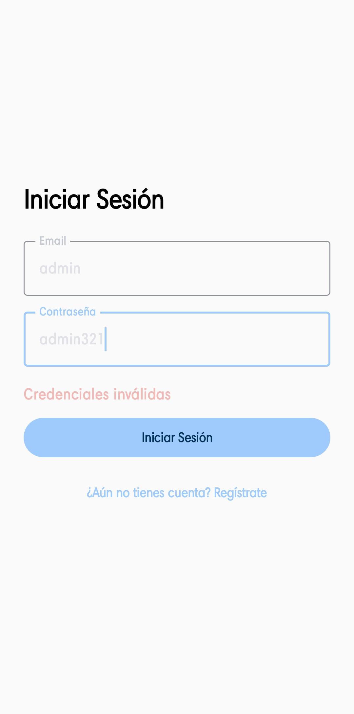
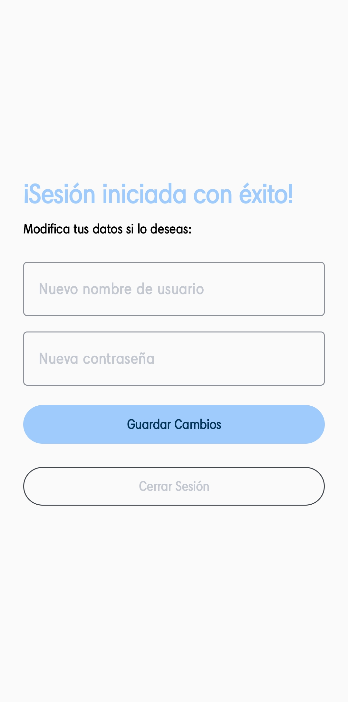
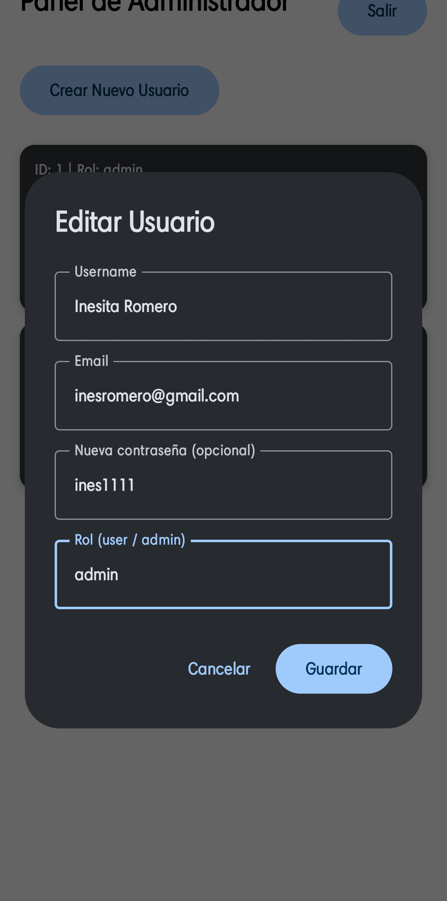
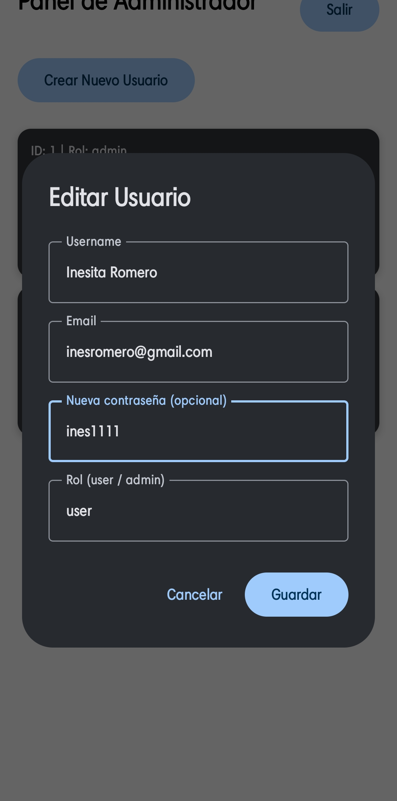
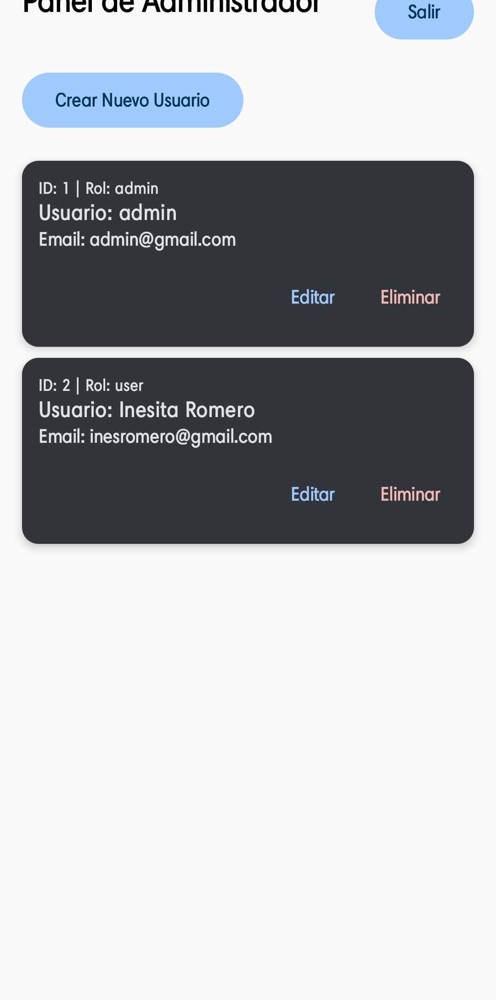

# Instituto Politécnico Nacional
## Escuela Superior de Cómputo

## Portada

- **Nombre completo:** Chávez Romero Jonathan
- **Número de boleta:** 2024630102
- **Grupo:** 7CV4
- **Unidad de aprendizaje:** Desarrollo de Aplicaciones Móviles Nativas
- **Profesor:** Gabriel Hurtado Avilés
- **Fecha de entrega:** 18 de septiembre de 2026

---

## Práctica 2: Aplicación móvil básica para operaciones CRUD con un servicio REST

## Introducción

Esta práctica consiste en el desarrollo de un sistema completo de autenticación y gestión de usuarios (CRUD), compuesto por dos partes:

1. Un **backend REST dockerizado**, construido en **Node.js con Express**, que expone endpoints de registro, inicio de sesión y operaciones CRUD sobre el recurso `Usuario`.
2. Una **aplicación móvil Android**, construida en **Kotlin con Jetpack Compose**, que consume dicha API mediante **Retrofit**.

### Operaciones CRUD y endpoints

| Operación CRUD | Endpoint | Descripción |
|---|---|---|
| **Create** | `POST /register` | Registro de una nueva cuenta de usuario |
| **Read** | `GET /users` y `GET /users/:id` | Consulta de todos los usuarios (solo admin) o de un usuario específico |
| **Update** | `PUT /users/:id` | Modificación de los datos del propio perfil, o de cualquier usuario si quien solicita es admin |
| **Delete** | `DELETE /users/:id` | Eliminación de la propia cuenta, o de cualquier cuenta si quien solicita es admin |

Adicionalmente, se implementó un **sistema de roles** (`admin` y `user`) que añade una capa de autorización sobre la autenticación: no solo se valida *quién* es el usuario (autenticación, vía JWT), sino *qué puede hacer* según su rol (autorización).

### Stack elegido y justificación

| Componente | Tecnología | Justificación |
|---|---|---|
| Servidor / Framework | **Node.js + Express** | Minimalista y directo para exponer una API REST; permitió una curva de aprendizaje rápida al trabajar el proyecto de forma individual |
| ORM | **Sequelize** | Permite definir el modelo `User` como una clase de JavaScript, sin escribir SQL manualmente, y genera migraciones/sincronización de tablas de forma automática |
| Base de datos | **SQLite** | No requiere un servidor de base de datos externo; el archivo se genera automáticamente al iniciar, lo cual simplifica la reproducibilidad del proyecto |
| Hasheo de contraseñas | **bcryptjs** | Aplica hasheo con sal (salt) sobre las contraseñas antes de almacenarlas, garantizando que nunca se guarden en texto plano |
| Sesiones seguras | **jsonwebtoken (JWT)** | Genera tokens firmados con expiración, evitando el manejo de sesiones con estado en el servidor |
| Cliente HTTP (Android) | **Retrofit + OkHttp** | Permite declarar los endpoints de la API como funciones de Kotlin `suspend`, integrándose de forma natural con corrutinas |
| UI móvil | **Jetpack Compose (Material 3)** | Framework moderno de UI declarativa recomendado actualmente por Google para nuevos proyectos Android |

---

## Desarrollo

### Conceptos del Ejercicio 2

**Docker:** es una plataforma que empaqueta una aplicación junto con todo lo que necesita para ejecutarse (runtime, dependencias, configuración) dentro de una unidad aislada llamada contenedor. A diferencia de una máquina virtual, un contenedor comparte el núcleo del sistema operativo anfitrión, por lo que su arranque es prácticamente instantáneo. Su principal ventaja es la **reproducibilidad**: el proyecto se ejecuta de la misma manera en cualquier equipo que tenga Docker instalado, sin importar el sistema operativo o las dependencias previamente instaladas.

**Imagen y contenedor:** la imagen es una plantilla inmutable que contiene el sistema de archivos y las instrucciones necesarias para ejecutar la aplicación. El contenedor es una instancia en ejecución de esa imagen, y es efímero: al detenerse o eliminarse, cualquier información que no haya sido explícitamente persistida (por ejemplo, en un volumen) se pierde. En este proyecto, el volumen definido en `docker-compose.yml` permite que el archivo `database.sqlite` sobreviva a la eliminación o reconstrucción del contenedor.

**Dockerfile:** es el archivo de instrucciones que Docker ejecuta paso a paso para construir la imagen del backend. En este proyecto se definieron las siguientes instrucciones: `FROM` (imagen base `node:20-alpine`), `WORKDIR` (directorio de trabajo `/app` dentro del contenedor), `COPY` (copiado de `package.json` primero, y del resto del código después, para aprovechar el cacheo de capas de Docker), `RUN` (`npm install`, ejecutado durante la construcción de la imagen), `EXPOSE` (documentación del puerto 5000 usado por la aplicación) y `CMD` (comando de arranque `node src/app.js`, ejecutado cada vez que se inicia un contenedor).

**docker-compose.yml:** es un archivo en formato YAML que describe la aplicación como un conjunto de servicios, especificando sus puertos, volúmenes y variables de entorno, de manera que todo el entorno pueda levantarse o detenerse con un solo comando (`docker compose up --build`). En este proyecto se definió el mapeo de puertos `5000:5000`, un volumen (`./data:/app/data`) para persistir la base de datos, y la carga de variables de entorno desde el archivo `.env`.

**Backend o servicio REST:** es un programa que corre del lado del servidor y expone la lógica de negocio mediante rutas accesibles por HTTP. Recibe peticiones con los verbos GET, POST, PUT y DELETE, valida la información recibida, consulta o modifica la base de datos, y responde en formato JSON junto con el código de estado HTTP correspondiente a cada situación.

**ORM y base de datos:** un ORM (Object-Relational Mapping), en este caso Sequelize, permite manipular las tablas de la base de datos como si fueran clases y objetos del lenguaje de programación, sin necesidad de escribir sentencias SQL directamente. En este proyecto se utiliza SQLite como motor de base de datos, el cual almacena toda la información en un único archivo local (`database.sqlite`), sin requerir un servidor de base de datos independiente.

### Modelo de datos

```javascript
User {
  id: INTEGER (autoincremental, llave primaria — generado automáticamente por Sequelize)
  username: STRING (único, obligatorio)
  email: STRING (único, obligatorio)
  password_hash: STRING (obligatorio — nunca se almacena la contraseña en texto plano)
  role: STRING (valores: "user" | "admin" — por defecto "user")
  createdAt / updatedAt: generados automáticamente por Sequelize
}
```

### Documentación de endpoints

#### `POST /register`
Registra una nueva cuenta de usuario. Público (no requiere token).

**Body de la petición:**
```json
{
  "username": "jony",
  "email": "jony@test.com",
  "password": "clave123"
}
```

**Respuesta exitosa — `201 Created`:**
```json
{
  "id": 1,
  "username": "jony",
  "email": "jony@test.com",
  "role": "user"
}
```

**Errores posibles:**
- `400 Bad Request` — faltan campos obligatorios, o el email ya está registrado.

---

#### `POST /login`
Autentica a un usuario existente y devuelve un token JWT. Público.

**Body de la petición:**
```json
{
  "email": "jony@test.com",
  "password": "clave123"
}
```

**Respuesta exitosa — `200 OK`:**
```json
{
  "token": "eyJhbGciOiJIUzI1NiIsInR5cCI6IkpXVCJ9..."
}
```

**Errores posibles:**
- `400 Bad Request` — faltan campos obligatorios.
- `401 Unauthorized` — email no registrado o contraseña incorrecta (se responde con el mismo mensaje genérico en ambos casos, por seguridad, para no revelar qué correos existen en el sistema).

---

#### `GET /users`
Lista todos los usuarios registrados. Requiere token válido **y** rol `admin`.

**Headers:**
```
Authorization: Bearer <token>
```

**Respuesta exitosa — `200 OK`:**
```json
[
  { "id": 1, "username": "jony", "email": "jony@test.com", "role": "user" },
  { "id": 2, "username": "admin", "email": "admin@practica2.com", "role": "admin" }
]
```

**Errores posibles:**
- `401 Unauthorized` — token ausente, inválido o expirado.
- `403 Forbidden` — el token es válido, pero el usuario no tiene rol `admin`.

---

#### `GET /users/:id`
Obtiene los datos de un usuario específico. Requiere token válido; solo puede consultarlo el propio usuario o un admin.

**Headers:**
```
Authorization: Bearer <token>
```

**Respuesta exitosa — `200 OK`:**
```json
{ "id": 1, "username": "jony", "email": "jony@test.com", "role": "user" }
```

**Errores posibles:**
- `401 Unauthorized` — token ausente, inválido o expirado.
- `403 Forbidden` — el usuario autenticado no es dueño del recurso ni admin.
- `404 Not Found` — el `id` solicitado no existe.

---

#### `PUT /users/:id`
Actualiza los datos de un usuario. Requiere token válido; solo puede modificarlo el propio usuario o un admin. El campo `role` únicamente puede ser modificado por un usuario con rol `admin`.

**Headers:**
```
Authorization: Bearer <token>
```

**Body de la petición** (todos los campos son opcionales):
```json
{
  "username": "jonyNuevo",
  "email": "nuevo@test.com",
  "password": "nuevaClave123",
  "role": "admin"
}
```

**Respuesta exitosa — `200 OK`:**
```json
{ "id": 1, "username": "jonyNuevo", "email": "nuevo@test.com", "role": "user" }
```

**Errores posibles:**
- `401 Unauthorized` — token ausente, inválido o expirado.
- `403 Forbidden` — el usuario autenticado no es dueño del recurso ni admin.
- `404 Not Found` — el `id` solicitado no existe.

---

#### `DELETE /users/:id`
Elimina la cuenta de un usuario. Requiere token válido; solo puede eliminarla el propio usuario o un admin.

**Headers:**
```
Authorization: Bearer <token>
```

**Respuesta exitosa — `200 OK`:**
```json
{ "message": "Usuario eliminado correctamente" }
```

**Errores posibles:**
- `401 Unauthorized` — token ausente, inválido o expirado.
- `403 Forbidden` — el usuario autenticado no es dueño del recurso ni admin.
- `404 Not Found` — el `id` solicitado no existe.

---

### Instrucciones de instalación y ejecución

**Requisitos previos:** tener Docker Desktop instalado y en ejecución.

1. Clonar el repositorio:
   ```bash
   git clone [URL DEL REPOSITORIO]
   ```
2. Ubicarse en la carpeta del backend:
   ```bash
   cd backend
   ```
3. Levantar el servicio:
   ```bash
   docker compose up --build
   ```
4. El backend queda disponible en `http://localhost:5000` (o en la IP local del equipo anfitrión, para pruebas desde un dispositivo físico — ver siguiente sección).

5. La IP está definida directamente en el código fuente:
>
> **Archivo:** `app-android/app/src/main/java/.../data/RetrofitClient.kt`
> ```kotlin
> private const val BASE_URL = "http://192.168.1.73:5000/"
> ```
>
> Antes de compilar y ejecutar la aplicación en una máquina distinta, es necesario:
> 1. Obtener la IP local del equipo donde corre el backend (`ipconfig` en Windows, `ifconfig` o `ip addr` en Linux/Mac).
> 2. Reemplazar la IP en `BASE_URL` por esa dirección.
> 3. Asegurarse de que el dispositivo Android (físico) esté conectado a la **misma red WiFi** que el equipo donde corre el backend.
> 4. Si se usa un emulador de Android en lugar de un dispositivo físico, `BASE_URL` debe ser `http://10.0.2.2:5000/` en su lugar.
> 5. En Windows, puede ser necesario permitir conexiones entrantes al puerto 5000 en el Firewall (ver sección de Conclusiones).

### Capturas de pantalla

> Las siguientes imágenes están almacenadas en la carpeta `docs/` del repositorio.

**Registro de usuario:**



**Inicio de sesión:**



**Manejo de credenciales incorrectas:**



**Operación Read — vista de usuario normal (propio perfil):**



**Operación Read — vista de administrador (lista de usuarios):**


**Operación Update — edición de perfil:**



**Operación Update — administrador cambiando el rol de un usuario:**



**Operación Delete — eliminación de una cuenta:**



---

## Conclusiones

El desarrollo de esta practica fue muy desafiante e interesante ya que nunca habia trabajado con Docker y Jetpack Compose, por lo que fue un gran reto aprender a utilizar estas herramientas y aplicarlas en un proyecto real. La experiencia adquirida me permitió comprender mejor el flujo de trabajo de una aplicación móvil que interactúa con un backend REST, así como la importancia de la seguridad en la gestión de usuarios y la autenticación mediante JWT.

---

## Bibliografía

Docker Inc. (s.f.). *Docker Compose overview*. Docker Docs. https://docs.docker.com/compose/

Docker Inc. (s.f.). *Dockerfile reference*. Docker Docs. https://docs.docker.com/reference/dockerfile/

Express.js. (s.f.). *Express — Node.js web application framework*. https://expressjs.com/

Google Inc. (s.f.). *Jetpack Compose*. Android Developers. https://developer.android.com/jetpack/compose

Google Inc. (s.f.). *Kotlin coroutines on Android*. Android Developers. https://developer.android.com/kotlin/coroutines

Google Inc. (s.f.). *Navigation with Compose*. Android Developers. https://developer.android.com/develop/ui/compose/navigation

Kreling, N. (s.f.). *bcryptjs* [Paquete de software]. npm. https://www.npmjs.com/package/bcryptjs

Mozilla Foundation. (s.f.). *HTTP response status codes*. MDN Web Docs. https://developer.mozilla.org/en-US/docs/Web/HTTP/Status

Node.js Foundation. (s.f.). *Node.js documentation*. https://nodejs.org/en/docs

OpenJS Foundation. (s.f.). *dotenv* [Paquete de software]. npm. https://www.npmjs.com/package/dotenv

Sequelize contributors. (s.f.). *Sequelize — Feature-rich ORM for modern Node.js and TypeScript*. https://sequelize.org/docs/v6/

Square Inc. (s.f.). *Retrofit — A type-safe HTTP client for Android and the JVM*. https://square.github.io/retrofit/

Web IDL / Auth0. (s.f.). *Introduction to JSON Web Tokens*. JWT.io. https://jwt.io/introduction